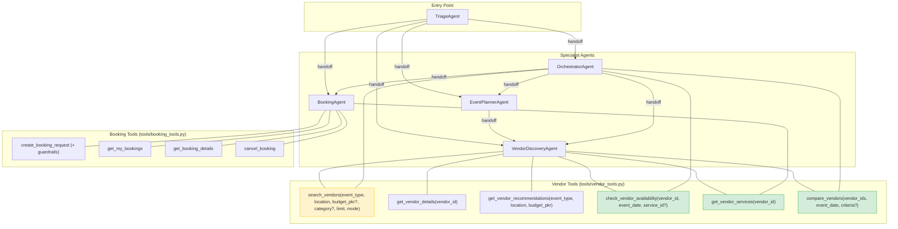
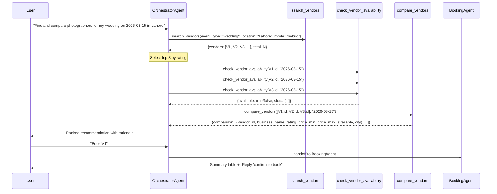

# Design Document: agentic-orchestrator-vendor-tools

## Overview

This feature extends the `packages/agentic_event_orchestrator` service with three new `@function_tool` definitions (`check_vendor_availability`, `get_vendor_services`, `compare_vendors`), upgrades `search_vendors` with a configurable `mode` parameter, adds HMAC service-auth headers to every outbound HTTP call, and wires the new tools into the correct agents. The result is a fully autonomous multi-step vendor selection workflow — search → availability check → compare → recommend — that the `OrchestratorAgent` can execute in a single conversation turn without user intervention between steps.

All changes are confined to `packages/agentic_event_orchestrator`. No backend schema changes are required; the feature consumes existing backend endpoints.

### Key Design Decisions

- **`asyncio.gather` for concurrent fetches in `compare_vendors`**: Fetching N vendor profiles and N availability checks sequentially would be O(2N) round-trips. Using `asyncio.gather` with `return_exceptions=True` makes them concurrent and handles partial failures gracefully without raising.
- **`make_service_headers` called per-request, not cached**: The HMAC signature includes a timestamp, so headers must be regenerated on every call. Caching would produce stale signatures that the backend rejects.
- **Tools return JSON strings, not dicts**: The OpenAI Agents SDK passes tool return values directly to the LLM as text. Returning a JSON string keeps the contract explicit and avoids SDK serialization surprises.
- **`compare_vendors` calls `get_vendor_details` and `check_vendor_availability` as Python functions, not as agent tool calls**: This avoids the overhead of re-entering the SDK tool dispatch loop and keeps the implementation testable with plain `respx` mocks.
- **Instruction updates stay under 3200 chars**: `MAX_INSTRUCTION_CHARS = 3200` is enforced at module import. All instruction changes are additive but compact; the validation in `validate_instruction_limits()` will catch any violation at startup.

## Architecture

### Component Diagram — Tool-to-Agent Wiring



**Legend:** Green = new tools. Yellow = modified tool. Unchanged tools shown for completeness.

### Autonomous Multi-Step Data Flow



## Components and Interfaces

### 1. `tools/vendor_tools.py` — New and Modified Tools

#### 1.1 Modified: `search_vendors`

```python
@function_tool
async def search_vendors(
    event_type: str,
    location: str,
    budget_pkr: Optional[float] = None,
    category: Optional[str] = None,
    limit: int = 10,
    mode: str = "hybrid",          # NEW: "keyword" | "semantic" | "hybrid"
) -> str:
    """Search the vendor marketplace for vendors matching the given criteria.
    Use mode='semantic' for descriptive queries (e.g. 'elegant outdoor venue'),
    mode='keyword' for category labels or vendor names, mode='hybrid' (default) otherwise.
    Returns a JSON string with a vendors list and total count."""
```

**Changes from current:**
- Add `mode: str = "hybrid"` parameter
- Pass `mode` as query param to backend
- Add `make_service_headers("GET", path)` merged into request headers
- Handle 503 + `AI_EMBEDDING_UNAVAILABLE` error code with specific message
- Handle 401/403 with auth failure message

#### 1.2 Modified: `get_vendor_details`

**Changes from current:**
- Add `make_service_headers("GET", path)` merged into request headers
- Handle 401/403 with auth failure message

#### 1.3 New: `check_vendor_availability`

```python
@function_tool
async def check_vendor_availability(
    vendor_id: str,
    event_date: str,               # ISO-8601: "YYYY-MM-DD"
    service_id: Optional[str] = None,
) -> str:
    """Check whether a vendor is available on a specific date.
    Returns a JSON string with vendor_id, available (bool), and slots list.
    Each slot has: id, vendor_id, service_id, start_date, end_date, is_available."""
```

**Endpoint:** `GET {BACKEND_API_URL}/api/v1/vendors/{vendor_id}/availability`
**Query params:** `start_date=event_date`, `end_date=event_date`, `service_id=service_id` (if provided)
**Auth:** `make_service_headers("GET", f"/api/v1/vendors/{vendor_id}/availability")`

**Return shapes:**
```python
# Success (200)
{"vendor_id": str, "available": bool, "slots": [{"id": str, "vendor_id": str,
  "service_id": str|None, "start_date": str, "end_date": str, "is_available": bool}]}

# Non-200
{"vendor_id": str, "available": False, "slots": [], "error": str}

# Network exception
{"vendor_id": str, "available": False, "slots": [], "error": str}

# 401/403
{"vendor_id": str, "available": False, "slots": [],
 "error": "Service authentication failed. Check SERVICE_SECRET configuration."}
```

#### 1.4 New: `get_vendor_services`

```python
@function_tool
async def get_vendor_services(vendor_id: str) -> str:
    """Get the active services offered by a vendor, including pricing and capacity.
    Returns a JSON string with a services list (only active services).
    Each service has: id, name, price_min, price_max, capacity."""
```

**Endpoint:** `GET {BACKEND_API_URL}/api/v1/public_vendors/{vendor_id}`
**Auth:** `make_service_headers("GET", f"/api/v1/public_vendors/{vendor_id}")`
**Filtering:** Only entries where `is_active == True` are included in output.

**Return shapes:**
```python
# Success (200) with active services
{"vendor_id": str, "services": [{"id": str, "name": str,
  "price_min": float, "price_max": float, "capacity": int}]}

# Empty string vendor_id (no HTTP call made)
{"vendor_id": "", "services": [], "error": "vendor_id must not be empty"}

# No active services / missing field
{"vendor_id": str, "services": []}

# Non-200 or network exception
{"vendor_id": str, "services": [], "error": str}
```

#### 1.5 New: `compare_vendors`

```python
@function_tool
async def compare_vendors(
    vendor_ids: list[str],
    event_date: str,               # ISO-8601: "YYYY-MM-DD"
    criteria: Optional[list[str]] = None,  # default: ["rating", "price", "availability"]
) -> str:
    """Compare multiple vendors side-by-side on rating, price, and availability.
    Requires at least 2 and at most 10 vendor IDs.
    Returns a JSON string with a comparison list ordered by rating descending,
    ties broken by business_name ascending."""
```

**Implementation:** Uses `asyncio.gather` to fetch all vendor details and availability concurrently. Calls the underlying `_get_vendor_details_raw` and `_check_vendor_availability_raw` helper functions (not the `@function_tool` wrappers) to avoid SDK overhead.

**Validation (before any HTTP calls):**
- `len(vendor_ids) < 2` → error: "At least two vendor IDs are required for comparison"
- `len(vendor_ids) > 10` → error: "vendor_ids must contain between 2 and 10 entries"
- Any `""` in `vendor_ids` → error: "vendor_ids must not contain empty strings"
- `event_date` before current UTC date → error: "event_date must be a future date"

**Return shapes:**
```python
# Success
{"comparison": [{"vendor_id": str, "business_name": str, "rating": float,
  "price_min": float, "price_max": float, "available": bool, "city": str}]}
# Sorted: rating DESC, business_name ASC. Failed vendors have null fields.

# Validation error
{"error": str}
```

### 2. `tools/__init__.py` — Export New Tools

```python
# Diff: add to existing imports
from .vendor_tools import (
    search_vendors,
    get_vendor_details,
    get_vendor_recommendations,
    check_vendor_availability,   # NEW
    get_vendor_services,         # NEW
    compare_vendors,             # NEW
)

__all__ = [
    "search_vendors", "get_vendor_details", "get_vendor_recommendations",
    "check_vendor_availability", "get_vendor_services", "compare_vendors",  # NEW
    "create_booking_request", "get_my_bookings", "get_booking_details", "cancel_booking",
    "get_user_events", "create_event", "get_event_details", "update_event_status", "query_event_types",
]
```

### 3. `pipeline/vendor_discovery.py` — Add New Tools

```python
# Diff: add new tools to import and tools list
from tools import (
    search_vendors, get_vendor_details, get_vendor_recommendations,
    check_vendor_availability, get_vendor_services, compare_vendors,  # NEW
)

def build_vendor_discovery_agent(model, booking=None):
    return Agent(
        name="VendorDiscoveryAgent",
        model=model,
        instructions=VENDOR_DISCOVERY_INSTRUCTIONS,
        tools=[
            search_vendors, get_vendor_details, get_vendor_recommendations,
            check_vendor_availability, get_vendor_services, compare_vendors,  # NEW
        ],
        handoffs=[booking] if booking else [],
    )
```

### 4. `pipeline/orchestrator.py` — Add Direct Tools

```python
# Diff: add tools import and tools list
from tools import search_vendors, check_vendor_availability, compare_vendors  # NEW

def build_orchestrator_agent(model, event_planner, vendor_discovery, booking):
    return Agent(
        name="OrchestratorAgent",
        model=model,
        instructions=ORCHESTRATOR_INSTRUCTIONS,
        tools=[search_vendors, check_vendor_availability, compare_vendors],  # NEW
        handoffs=[event_planner, vendor_discovery, booking],
    )
```

### 5. `pipeline/booking.py` — Add `get_vendor_services`

```python
# Diff: add get_vendor_services to import and tools list
from tools import get_my_bookings, get_booking_details, cancel_booking, get_vendor_services  # NEW

def build_booking_agent(model):
    return Agent(
        name="BookingAgent",
        model=model,
        instructions=BOOKING_INSTRUCTIONS,
        tools=[
            create_booking_request, get_my_bookings, get_booking_details,
            cancel_booking, get_vendor_services,  # NEW
        ],
    )
```

### 6. `pipeline/instructions.py` — Instruction Updates

All changes are additive. The `validate_instruction_limits()` function enforces the 3200-char ceiling at startup.

#### `VENDOR_DISCOVERY_INSTRUCTIONS` — add mode selection guidance

```diff
 You are a vendor discovery specialist for events in Pakistan.

 WORKFLOW:
 1. Extract event_type, location, budget_pkr from conversation — ask ONLY for what is missing, one question at a time
 2. Once you have event_type and location, call search_vendors immediately — do NOT keep asking questions
+   SEARCH MODE: use mode="semantic" for descriptive queries (e.g. "elegant", "affordable", "outdoor");
+   use mode="keyword" for category names (e.g. "catering", "photography") or specific vendor names;
+   use mode="hybrid" (default) in all other cases.
 3. Present top 3-5 results: name, category, price range, rating — one line each
+   FORMAT: {business_name} — {category} — PKR {price_min}–{price_max} — ⭐ {rating}
 4. If user wants to book → hand off to BookingAgent
+5. To check availability: call check_vendor_availability(vendor_id, event_date)
+6. To compare vendors: call compare_vendors(vendor_ids, event_date)
+7. To list services: call get_vendor_services(vendor_id)
```

#### `ORCHESTRATOR_INSTRUCTIONS` — add autonomous workflow steps

```diff
 You are the master orchestrator. Coordinate multi-step event planning workflows.

-Delegate to specialist agents. Give brief status updates between steps. Ask for missing info concisely.
+VENDOR SELECTION WORKFLOW — execute autonomously in one turn, no user prompts between steps:
+1. call search_vendors → take top 3 by rating
+2. call check_vendor_availability for each of the 3 vendors
+3. call compare_vendors on those 3 vendors
+4. present: all vendors checked, which are available, top recommendation with rationale (rating/price/availability)
+5. to book: hand off to BookingAgent — do NOT call create_booking_request directly
+If all vendors unavailable: offer 3 alternative dates within 30 days or a different city.
+If search returns zero results: inform user, suggest adjusting event type, city, or budget.
```

#### `BOOKING_INSTRUCTIONS` — reinforce confirmation gate

```diff
 MANDATORY CONFIRMATION — DO NOT SKIP:
 Before calling create_booking_request:
 1. Collect: vendor_id, service_id, event_date, event_name, guest_count
+   Use get_vendor_services(vendor_id) to list available services if service_id is unknown.
 2. Show a 5-row summary table
 3. Ask: "Reply **'confirm'** to book or **'cancel'** to abort."
 4. Only call create_booking_request after explicit confirmation.
+CRITICAL VIOLATION: calling create_booking_request without prior confirmation.
+If user replies anything other than "confirm" (case-insensitive), treat as cancellation.
```

#### `EVENT_PLANNER_INSTRUCTIONS` — add proactive vendor prompt

```diff
 4. Confirm with event ID in one line
-5. Ask if they want vendor recommendations
+5. Ask: "Would you like me to find vendors for this event?" — if yes or no explicit decline,
+   hand off to VendorDiscoveryAgent with event_type, city, and budget as context.
+   If user declines, acknowledge and end the turn.
```

## Data Models

### Availability Slot (from backend response)

```python
class AvailabilitySlot(TypedDict):
    id: str
    vendor_id: str
    service_id: str | None
    start_date: str          # ISO-8601
    end_date: str            # ISO-8601
    is_available: bool
```

### Vendor Comparison Entry (tool output)

```python
class VendorComparisonEntry(TypedDict):
    vendor_id: str
    business_name: str | None    # None if fetch failed
    rating: float | None         # None if fetch failed
    price_min: float | None      # None if fetch failed
    price_max: float | None      # None if fetch failed
    available: bool | None       # None if availability fetch failed
    city: str | None             # None if fetch failed
```

### Service Entry (tool output)

```python
class ServiceEntry(TypedDict):
    id: str
    name: str
    price_min: float
    price_max: float
    capacity: int
```

### Internal Helper Functions

To avoid calling `@function_tool` wrappers from within `compare_vendors` (which would re-enter the SDK dispatch loop), two internal async helpers are extracted:

```python
async def _fetch_vendor_details(vendor_id: str, backend_url: str) -> dict:
    """Raw vendor profile fetch — returns parsed dict or {} on failure."""

async def _fetch_vendor_availability(vendor_id: str, event_date: str, backend_url: str) -> bool:
    """Raw availability check — returns True if available, False on failure."""
```

The `@function_tool` wrappers (`get_vendor_details`, `check_vendor_availability`) call these helpers and serialize to JSON. `compare_vendors` also calls these helpers directly.

## Correctness Properties

*A property is a characteristic or behavior that should hold true across all valid executions of a system — essentially, a formal statement about what the system should do. Properties serve as the bridge between human-readable specifications and machine-verifiable correctness guarantees.*

### Property 1: Service auth headers are present on every outbound request

*For any* vendor tool call (`search_vendors`, `get_vendor_details`, `check_vendor_availability`, `get_vendor_services`) with any valid input, the outgoing HTTP request SHALL always include all three service auth headers: `X-Service-Timestamp`, `X-Service-Signature`, and `X-Service-Name`.

**Validates: Requirements 7.1, 7.2, 7.3, 7.4, 7.5, 7.6**

---

### Property 2: Tools always return valid JSON (no raised exceptions)

*For any* input to any of the five vendor tools (`search_vendors`, `get_vendor_details`, `check_vendor_availability`, `get_vendor_services`, `compare_vendors`), and for any backend response (including network exceptions, 4xx, 5xx, malformed JSON), the tool SHALL always return a string that is parseable by `json.loads` without raising an exception.

**Validates: Requirements 8.4, 1.5, 2.5, 4.5, 8.1, 8.2**

---

### Property 3: Non-200 responses always produce an error field and empty result list

*For any* vendor tool call where the backend returns a non-200 HTTP status code, the returned JSON SHALL always contain an `error` field (non-empty string) and an empty result list (`vendors: []`, `slots: []`, or `services: []` as appropriate). The `available` field in `check_vendor_availability` SHALL be `false`.

**Validates: Requirements 1.4, 2.5, 4.5, 8.2**

---

### Property 4: `get_vendor_services` returns only active services

*For any* vendor profile returned by the backend containing a `services` list with mixed `is_active` values, the `get_vendor_services` tool SHALL return only entries where `is_active` is `true`, and each returned entry SHALL contain exactly the fields `id`, `name`, `price_min`, `price_max`, and `capacity`.

**Validates: Requirements 2.3**

---

### Property 5: `check_vendor_availability` available flag matches slots non-emptiness

*For any* 200 response from the backend to `check_vendor_availability`, the `available` field in the returned JSON SHALL be `true` if and only if the `slots` list is non-empty.

**Validates: Requirements 1.3**

---

### Property 6: `compare_vendors` output is sorted by rating descending, then business_name ascending

*For any* valid list of 2–10 vendor IDs passed to `compare_vendors`, the returned `comparison` list SHALL be ordered such that entries with higher `rating` appear before entries with lower `rating`, and among entries with equal `rating`, entries with lexicographically smaller `business_name` appear first. Entries with `null` rating SHALL appear last.

**Validates: Requirements 3.3**

---

### Property 7: `compare_vendors` includes all vendor IDs in output, even on partial failure

*For any* list of vendor IDs passed to `compare_vendors` where fetching details for some vendors fails, the returned `comparison` list SHALL contain one entry for every vendor ID in the input, with failed vendors having `null` for all fields except `vendor_id`.

**Validates: Requirements 3.6**

---

### Property 8: `search_vendors` passes mode parameter to backend

*For any* call to `search_vendors` with any of the three valid mode values (`"keyword"`, `"semantic"`, `"hybrid"`), the outgoing HTTP request SHALL include `mode` as a query parameter with the exact value passed by the caller.

**Validates: Requirements 4.2**

---

### Property 9: 401/403 responses produce the specific auth failure message

*For any* vendor tool call where the backend returns a 401 or 403 status code, the returned JSON SHALL contain an `error` field with the exact message `"Service authentication failed. Check SERVICE_SECRET configuration."`.

**Validates: Requirements 7.8**

## Error Handling

### Error Taxonomy

| Scenario | Tool Behavior | JSON Shape |
|---|---|---|
| Backend 200 | Normal return | `{result_field: [...]}` |
| Backend 401/403 | Auth failure message | `{..., "error": "Service authentication failed. Check SERVICE_SECRET configuration."}` |
| Backend 503 + `AI_EMBEDDING_UNAVAILABLE` (semantic mode only) | Specific semantic error | `{"vendors": [], "error": "Semantic search is temporarily unavailable. Please try keyword or hybrid search."}` |
| Backend 4xx (other) | Error with status code | `{..., "error": "HTTP 4xx: <message>"}` |
| Backend 5xx | Service unavailable | `{..., "error": "Vendor service temporarily unavailable (HTTP 5xx)"}` |
| `httpx.ConnectError` | Connection error | `{..., "error": "Could not connect to vendor service"}` |
| `httpx.TimeoutException` | Timeout | `{..., "error": "Vendor service request timed out"}` |
| Any other exception | Generic error | `{..., "error": "An unexpected error occurred"}` |

**Critical rule:** No tool may propagate a raw exception. Every tool wraps its entire body in `try/except Exception`. The `except` block must not include stack traces, internal hostnames, or exception class names in the returned JSON.

### `compare_vendors` Partial Failure

When `asyncio.gather(return_exceptions=True)` returns an exception for a specific vendor, that vendor's entry in the comparison list is populated as:

```python
{
    "vendor_id": vendor_id,
    "business_name": None,
    "rating": None,
    "price_min": None,
    "price_max": None,
    "available": None,
    "city": None,
}
```

Entries with `None` rating sort after all entries with a numeric rating.

### Service Auth Failure at Startup

`service_auth._get_secret()` already logs a warning when `SERVICE_SECRET` is empty. No additional startup code is needed — the existing warning in `service_auth.py` satisfies Requirement 7.7.

## Testing Strategy

### Test File: `tests/test_vendor_tools.py`

All tests use `respx` to mock `httpx.AsyncClient` calls. No real HTTP requests are made. No real LLM calls are made. Tests run with `uv run pytest tests/test_vendor_tools.py`.

#### Property-Based Testing Library

**`hypothesis`** is used for property-based tests. It is already listed in `pyproject.toml` dev-dependencies. Minimum 100 examples per property test (configured via `@settings(max_examples=100)`).

#### Test Structure

```
tests/test_vendor_tools.py
├── TestSearchVendors
│   ├── test_mode_param_passed_to_backend [PROPERTY 8]
│   ├── test_service_auth_headers_present [PROPERTY 1]
│   ├── test_non_200_returns_error_and_empty_vendors [PROPERTY 3]
│   ├── test_semantic_503_returns_specific_message [EDGE CASE - Req 4.4]
│   ├── test_401_403_returns_auth_failure_message [PROPERTY 9]
│   └── test_always_returns_valid_json [PROPERTY 2]
│
├── TestCheckVendorAvailability
│   ├── test_service_auth_headers_present [PROPERTY 1]
│   ├── test_available_true_iff_slots_nonempty [PROPERTY 5]
│   ├── test_non_200_returns_available_false [PROPERTY 3]
│   ├── test_network_exception_returns_safe_json [EDGE CASE - Req 1.5]
│   ├── test_401_403_returns_auth_failure_message [PROPERTY 9]
│   └── test_always_returns_valid_json [PROPERTY 2]
│
├── TestGetVendorServices
│   ├── test_only_active_services_returned [PROPERTY 4]
│   ├── test_service_auth_headers_present [PROPERTY 1]
│   ├── test_empty_vendor_id_returns_error_no_http [EDGE CASE - Req 2.7]
│   ├── test_non_200_returns_error_and_empty_services [PROPERTY 3]
│   └── test_always_returns_valid_json [PROPERTY 2]
│
├── TestCompareVendors
│   ├── test_output_sorted_by_rating_desc_name_asc [PROPERTY 6]
│   ├── test_all_vendor_ids_in_output_on_partial_failure [PROPERTY 7]
│   ├── test_fewer_than_2_vendors_returns_error [EDGE CASE - Req 3.4]
│   ├── test_more_than_10_vendors_returns_error [EDGE CASE - Req 3.5]
│   ├── test_empty_string_in_vendor_ids_returns_error [EDGE CASE - Req 3.5]
│   ├── test_past_event_date_returns_error [EDGE CASE - Req 3.8]
│   └── test_always_returns_valid_json [PROPERTY 2]
│
└── TestInstructionLimits
    ├── test_all_instructions_under_3200_chars [SMOKE]
    ├── test_vendor_discovery_instructions_contain_mode_guidance [SMOKE - Req 4.6]
    ├── test_orchestrator_instructions_contain_workflow_steps [SMOKE - Req 6.2]
    └── test_booking_instructions_contain_confirmation_gate [SMOKE - Req 9.5]
```

#### Key Test Patterns

**Property test with `respx` and `hypothesis`:**

```python
from hypothesis import given, settings
from hypothesis import strategies as st
import respx, httpx, json, pytest

@given(
    vendor_id=st.text(min_size=1, max_size=50, alphabet=st.characters(whitelist_categories=("Lu", "Ll", "Nd"))),
    event_date=st.dates(min_value=date.today() + timedelta(days=1), max_value=date(2030, 12, 31)).map(str),
)
@settings(max_examples=100)
@pytest.mark.asyncio
async def test_service_auth_headers_present(vendor_id, event_date):
    """Property 1: service auth headers always present on check_vendor_availability."""
    with respx.mock:
        route = respx.get(re.compile(r".*/vendors/.*/availability.*")).mock(
            return_value=httpx.Response(200, json={"data": {"slots": []}})
        )
        await check_vendor_availability(vendor_id=vendor_id, event_date=event_date)
        request = route.calls[0].request
        assert "X-Service-Timestamp" in request.headers
        assert "X-Service-Signature" in request.headers
        assert "X-Service-Name" in request.headers
```

**Property test for JSON safety:**

```python
@given(status_code=st.integers(min_value=400, max_value=599))
@settings(max_examples=100)
@pytest.mark.asyncio
async def test_always_returns_valid_json(status_code):
    """Property 2: tool always returns parseable JSON regardless of backend response."""
    with respx.mock:
        respx.get(re.compile(r".*/public_vendors/search.*")).mock(
            return_value=httpx.Response(status_code, json={"error": {"message": "err"}})
        )
        result = await search_vendors(event_type="wedding", location="Lahore")
        parsed = json.loads(result)  # must not raise
        assert isinstance(parsed, dict)
```

**Property test for active-only filtering:**

```python
@given(services=st.lists(
    st.fixed_dictionaries({
        "id": st.uuids().map(str),
        "name": st.text(min_size=1, max_size=50),
        "price_min": st.floats(min_value=0, max_value=1_000_000),
        "price_max": st.floats(min_value=0, max_value=1_000_000),
        "capacity": st.integers(min_value=1, max_value=10_000),
        "is_active": st.booleans(),
    }),
    min_size=0, max_size=20,
))
@settings(max_examples=100)
@pytest.mark.asyncio
async def test_only_active_services_returned(services):
    """Property 4: get_vendor_services returns only active services."""
    with respx.mock:
        respx.get(re.compile(r".*/public_vendors/.*")).mock(
            return_value=httpx.Response(200, json={"data": {"services": services}})
        )
        result = await get_vendor_services(vendor_id="vendor-123")
        parsed = json.loads(result)
        active_ids = {s["id"] for s in services if s["is_active"]}
        returned_ids = {s["id"] for s in parsed["services"]}
        assert returned_ids == active_ids
```

### Unit Tests (Example-Based)

Complement property tests with concrete examples for:
- Exact error message strings (semantic 503, auth failure, empty vendor_id)
- `compare_vendors` with a known set of vendors to verify sort order
- Instruction string content assertions (mode guidance, workflow steps, confirmation gate text)
- Agent wiring: instantiate each agent and assert tool names in `[t.name for t in agent.tools]`

### What Is Not Tested

- Real LLM behavior (agent routing, handoff decisions, response formatting) — these depend on the model and are validated through manual QA
- Real backend HTTP calls — all mocked with `respx`
- `service_auth.verify_service_request` — already tested in the backend package
