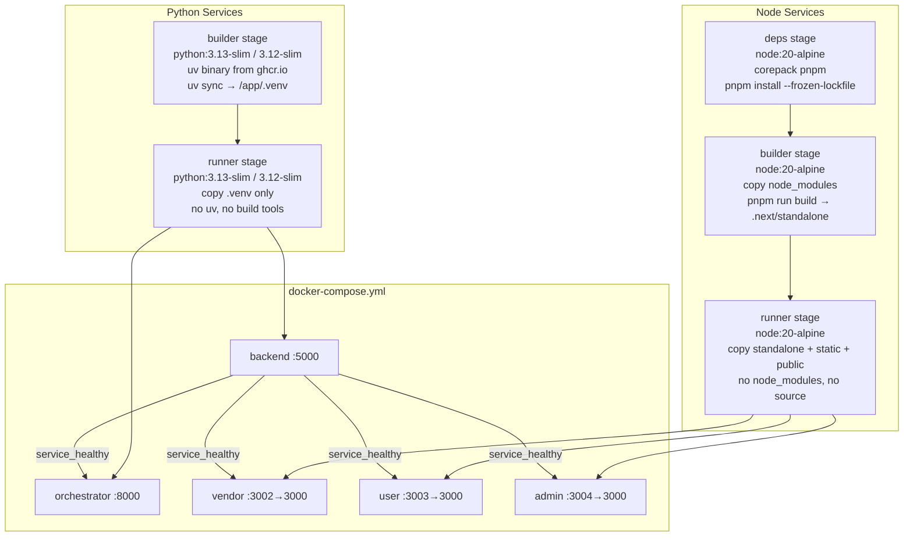

# Design Document: docker-light-images

## Overview

This design covers the Docker build pipeline for all five services in the Event-AI monorepo.
The goal is minimal final image size, zero build-tool leakage into production images, and a
single `docker-compose.yml` that wires the full stack together with health checks, resource
limits, and correct dependency ordering.

Two distinct runtime families drive two distinct Dockerfile patterns:

- **Python services** (`backend`, `orchestrator`) — 2-stage: builder + runner
- **Node services** (`vendor`, `user`, `admin`) — 3-stage: deps + builder + runner

All five services share the same security baseline: non-root UID 1001, `--chown` on every
`COPY`, no secrets in image layers, and a tight `.dockerignore` per service.

---

## Architecture

### Build Pipeline Overview



### Key Design Decisions

**Why `python:3.13-slim` / `python:3.12-slim` instead of Alpine for Python?**
uv is a compiled Rust binary that links against glibc. Alpine uses musl libc, which causes
runtime linker failures. Debian slim (~50 MB) provides glibc and is the correct base.

**Why `node:20-alpine` for Node services?**
Node.js Alpine images are statically linked and work correctly. Alpine's smaller footprint
(~50 MB vs ~150 MB for Debian) is a meaningful saving for three identical services.

**Why copy the uv binary from `ghcr.io/astral-sh/uv:latest` instead of installing it?**
`COPY --from=ghcr.io/astral-sh/uv:latest /uv /usr/local/bin/uv` pulls a single pre-built
binary with no OS package manager involvement. It is pinned to the official release image,
avoids curl/wget in the build, and is trivially removed from the runner stage by simply not
copying it.

**Why `corepack enable && corepack prepare pnpm@latest --activate` instead of `npm install -g pnpm`?**
`npm install -g pnpm` invokes npm, which is banned by project convention. Corepack is
Node's built-in package manager shim — it activates pnpm without touching npm.

**Why Next.js `output: 'standalone'`?**
Standalone mode emits a self-contained `server.js` plus only the node_modules it actually
imports at runtime. The runner stage copies three directories (`.next/standalone`,
`.next/static`, `public`) and runs `node server.js` — no pnpm, no full node_modules tree.
Final image size drops from ~300 MB to ~30–50 MB.

---

## Components and Interfaces

### Python Service Dockerfile Pattern

Both `packages/backend` and `packages/agentic_event_orchestrator` follow this two-stage
pattern. The only differences are the Python version and the CMD/port.

```
Stage 1: builder
  Base:    python:3.13-slim  (backend) | python:3.12-slim  (orchestrator)
  Adds:    uv binary via COPY --from=ghcr.io/astral-sh/uv:latest
  Copies:  pyproject.toml + uv.lock  (manifests first — cache layer)
  Runs:    uv sync --frozen --no-dev --no-install-project
           with --mount=type=cache,target=/root/.cache/uv
  Output:  /app/.venv  (production virtualenv, no dev deps)

Stage 2: runner
  Base:    python:3.13-slim  (backend) | python:3.12-slim  (orchestrator)
  Creates: appgroup (GID 1001) + appuser (UID 1001)
  Copies:  /app/.venv from builder  (--chown=appuser:appgroup)
  Copies:  application source       (--chown=appuser:appgroup)
  Env:     PATH=/app/.venv/bin:$PATH, PYTHONDONTWRITEBYTECODE=1, PYTHONUNBUFFERED=1
  User:    appuser
  CMD:     uvicorn <module>:app --host 0.0.0.0 --port <port>
```

**Backend-specific:**
- Source dirs: `src/`, `alembic/`, `alembic.ini`
- CMD: `["uvicorn", "src.main:app", "--host", "0.0.0.0", "--port", "5000", "--workers", "2"]`
- Health: polls `http://localhost:5000/api/v1/health/db`

**Orchestrator-specific:**
- Source: entire `.` (all files not excluded by `.dockerignore`)
- CMD: `["uvicorn", "main:app", "--host", "0.0.0.0", "--port", "8000"]`
- Health: polls `http://localhost:8000/health`

### Node Service Dockerfile Pattern

All three Next.js portals (`vendor`, `user`, `admin`) share the same three-stage pattern.

```
Stage 1: deps
  Base:    node:20-alpine
  Enables: corepack → pnpm
  Copies:  package.json + pnpm-lock.yaml  (manifests first — cache layer)
  Runs:    pnpm install --frozen-lockfile
           with --mount=type=cache,target=/root/.local/share/pnpm/store
  Output:  /app/node_modules

Stage 2: builder
  Base:    node:20-alpine
  Enables: corepack → pnpm
  Copies:  node_modules from deps stage
  Copies:  application source
  ARG:     NEXT_PUBLIC_API_URL (baked at build time)
  Env:     NEXT_TELEMETRY_DISABLED=1
  Runs:    pnpm run build
  Output:  .next/standalone, .next/static, public

Stage 3: runner
  Base:    node:20-alpine
  Creates: appgroup (GID 1001) + appuser (UID 1001)
  Copies:  .next/standalone  (--chown=appuser:appgroup)
  Copies:  .next/static      (--chown=appuser:appgroup)
  Copies:  public            (--chown=appuser:appgroup)
  Env:     NODE_ENV=production, NEXT_TELEMETRY_DISABLED=1, HOSTNAME=0.0.0.0, PORT=3000
  User:    appuser
  CMD:     ["node", "server.js"]
```

**admin and user specific:**
- `next.config.ts` includes both `output: 'standalone'` and `transpilePackages: ["@event-ai/ui"]`
  because both portals depend on the shared `packages/ui` workspace package.

**vendor specific:**
- `next.config.js` includes `output: 'standalone'` (already present).
- No `transpilePackages` needed — vendor does not import `@event-ai/ui`.

### docker-compose.yml Service Wiring

```
backend (5000:5000)
  └─ healthcheck: python urllib → /api/v1/health/db
  └─ resources: 512M / 1.0 CPU

orchestrator (8000:8000)
  └─ depends_on: backend (service_healthy)
  └─ healthcheck: python urllib → /health
  └─ resources: 512M / 1.0 CPU

vendor (3002:3000)
  └─ depends_on: backend (service_healthy)
  └─ build arg: NEXT_PUBLIC_API_URL
  └─ healthcheck: wget → /
  └─ resources: 256M / 0.5 CPU

user (3003:3000)
  └─ depends_on: backend (service_healthy)
  └─ build arg: NEXT_PUBLIC_API_URL
  └─ healthcheck: wget → /
  └─ resources: 256M / 0.5 CPU

admin (3004:3000)
  └─ depends_on: backend (service_healthy)
  └─ build arg: NEXT_PUBLIC_API_URL
  └─ healthcheck: wget → /
  └─ resources: 256M / 0.5 CPU

network: public (bridge) — all services attached
```

### .dockerignore Strategy

Each service directory has its own `.dockerignore`. The build context is the service
directory (`context: ./packages/<service>`), so the ignore file only needs to cover
files within that directory.

**Common exclusions (all services):**
```
.env
.env.*
.env.local
.env.*.local
*.log
.git/
.gitignore
.vscode/
.idea/
README.md
```

**Python service additional exclusions:**
```
__pycache__/
*.pyc
*.pyo
.venv/
.pytest_cache/
tests/
.coverage
htmlcov/
dist/
*.egg-info/
```

**Node service additional exclusions:**
```
node_modules/
.next/
.turbo/
coverage/
__tests__/
*.test.ts
*.test.tsx
*.spec.ts
*.spec.tsx
```

**Rationale:** Excluding `.env*` prevents secrets from entering the build context entirely —
they never reach the Docker daemon, so they cannot appear in any layer even if a `COPY .`
instruction is used. Excluding `node_modules/` and `.next/` prevents stale local build
artefacts from polluting the image.

---

## Data Models

This feature does not introduce new application data models. The relevant "data" is the
structure of build artefacts and the configuration values passed between build stages.

### Build-Time Configuration Values

| Value | Mechanism | Services |
|---|---|---|
| `NEXT_PUBLIC_API_URL` | Docker build ARG → ENV | vendor, user, admin |
| `NEXT_TELEMETRY_DISABLED=1` | ENV in builder + runner | vendor, user, admin |
| `NODE_ENV=production` | ENV in runner | vendor, user, admin |
| `PYTHONDONTWRITEBYTECODE=1` | ENV in runner | backend, orchestrator |
| `PYTHONUNBUFFERED=1` | ENV in runner | backend, orchestrator |
| `PATH=/app/.venv/bin:$PATH` | ENV in runner | backend, orchestrator |

### Runtime-Only Configuration (via env_file / environment in compose)

| Value | Service | Source |
|---|---|---|
| `DATABASE_URL` | backend | `packages/backend/.env` |
| `DIRECT_URL` | backend | `packages/backend/.env` |
| `JWT_SECRET` | backend | `packages/backend/.env` |
| `GOOGLE_CLIENT_ID/SECRET` | backend | `packages/backend/.env` |
| `GEMINI_API_KEY` | orchestrator | `packages/agentic_event_orchestrator/.env` |
| `FRONTEND_URL` | backend | compose `environment:` block |
| `CORS_ORIGINS` | backend | compose `environment:` block |

Runtime secrets are injected at container start via `env_file:` — they are never present
in any image layer.

### Health Check Endpoints

| Service | Endpoint | Method | Expected |
|---|---|---|---|
| backend | `/api/v1/health/db` | HTTP GET | 200 |
| orchestrator | `/health` | HTTP GET | 200 |
| vendor | `/` | HTTP GET | 200 |
| user | `/` | HTTP GET | 200 |
| admin | `/` | HTTP GET | 200 |

---

## Correctness Properties

*A property is a characteristic or behavior that should hold true across all valid executions
of a system — essentially, a formal statement about what the system should do. Properties
serve as the bridge between human-readable specifications and machine-verifiable correctness
guarantees.*

### Applicability Assessment

This feature is a Docker build pipeline — Dockerfiles, a docker-compose.yml, and
`.dockerignore` files. It is declarative infrastructure configuration, not a function with
inputs and outputs. The primary verification approach is:

- **Structural inspection tests**: Parse Dockerfile text and assert required instructions
  are present, absent, or correctly ordered.
- **Smoke tests**: Build the image and verify it starts, the health endpoint responds, and
  the process runs as UID 1001.
- **Integration tests**: `docker-compose up` and verify inter-service health propagation.

Classic property-based testing (generating random inputs and asserting universal properties)
does not apply to Dockerfiles or docker-compose configuration — there are no functions to
call with varied inputs. However, several structural invariants can be expressed as
properties over the *set of all Dockerfiles in the project*, which is a finite, enumerable
collection. These are expressed below as universally quantified statements over that set.

**Property Reflection:** After reviewing all acceptance criteria, the following consolidations
were made:
- Requirements 1.1, 1.2, 1.3, 3.3 all concern build tool leakage → Property 1
- Requirements 5.1, 5.2, 5.3, 5.4 all concern non-root user setup → Property 2
- Requirements 6.1, 6.2, 6.3 all concern `.dockerignore` completeness → Property 3
- Requirements 9.1, 9.2, 9.3 all concern package manager compliance → Property 4
- Requirements 7.1, 7.4 concern health check presence → Property 5
- Requirements 1.4, 3.1, 10.2 all concern cache mounts → Property 6
- Requirements 8.5, 8.6, 8.8 are compose-level service invariants → Property 8
- Requirements 10.2 is subsumed by Property 6

### Property 1: No Build Tool Leakage into Runner Stages

*For any* Dockerfile in the project, the runner/final stage SHALL NOT contain the `uv`
binary, `pip`, `npm`, `node_modules` copied from a deps stage, or any build-only tool.
The runner stage must be derivable solely from the base image plus files explicitly copied
from earlier stages — specifically `.venv` for Python services and `.next/standalone`,
`.next/static`, `public` for Node services.

**Validates: Requirements 1.1, 1.2, 1.3, 3.3**

### Property 2: Non-Root User Invariant

*For any* Dockerfile in the project, the runner stage SHALL create a system group
`appgroup` (GID 1001) and system user `appuser` (UID 1001), set `USER appuser` before
`EXPOSE`, and every `COPY` instruction in the runner stage SHALL include
`--chown=appuser:appgroup`. No `USER root` instruction SHALL appear after `USER appuser`.

**Validates: Requirements 5.1, 5.2, 5.3, 5.4**

### Property 3: Build Context Secrets Exclusion

*For any* service directory in the project, a `.dockerignore` file SHALL be present and
SHALL contain patterns excluding `.env`, `.env.*`, `node_modules/`, `.next/`, `__pycache__/`,
`.venv/`, `*.pyc`, `.git/`, `.vscode/`, `.idea/`, and `*.log` from the build context.

**Validates: Requirements 6.1, 6.2, 6.3, 6.4**

### Property 4: Package Manager Compliance

*For any* Dockerfile in the project, no `RUN` instruction SHALL contain the strings
`pip install`, `npm install`, or `npm ci`. Python dependency installation SHALL use
`uv sync`; Node dependency installation SHALL use `pnpm install` activated via
`corepack enable && corepack prepare pnpm@latest --activate`.

**Validates: Requirements 9.1, 9.2, 9.3**

### Property 5: Health Check Presence and Parameters

*For any* Dockerfile in the project, a `HEALTHCHECK` instruction SHALL be present with
`--interval=30s`, `--timeout=5s`, `--retries=3`, and a `--start-period` of at least 15s.
For Node service Dockerfiles, the health check command SHALL use `wget -qO-` to poll
`http://localhost:3000/`.

**Validates: Requirements 7.1, 7.4**

### Property 6: Cache Mount Presence in Dependency Stages

*For any* Dockerfile in the project, the `RUN` instruction that installs dependencies
SHALL include a `--mount=type=cache` directive targeting the appropriate cache directory:
`/root/.cache/uv` for Python builder stages and `/root/.local/share/pnpm/store` for
Node deps stages.

**Validates: Requirements 1.4, 3.1, 10.2**

### Property 7: Manifest-First Layer Ordering

*For any* Dockerfile in the project, within each stage the instruction that copies
dependency manifests (`pyproject.toml`/`uv.lock` or `package.json`/`pnpm-lock.yaml`)
SHALL appear before the instruction that copies application source code.

**Validates: Requirements 10.1**

### Property 8: Compose Service Invariants

*For any* service defined in `docker-compose.yml`, the service SHALL have
`restart: unless-stopped`, a `deploy.resources.limits` block with memory and CPU values
(512M/1.0 CPU for Python services, 256M/0.5 CPU for Node services), and Node services
SHALL pass `NEXT_PUBLIC_API_URL` as a build ARG.

**Validates: Requirements 8.5, 8.6, 8.8**

### Property 9: Standalone Output Configuration

*For any* Next.js service (`vendor`, `user`, `admin`), the `next.config.ts` or
`next.config.js` file SHALL contain `output: 'standalone'` (or `output: "standalone"`).

**Validates: Requirements 4.1**

---

## Error Handling

### Build-Time Failures

| Failure Condition | Symptom | Resolution |
|---|---|---|
| `output: 'standalone'` absent from next.config | `.next/standalone` is empty; `COPY` in runner stage fails with "no such file" | Add `output: 'standalone'` to next.config |
| `uv.lock` missing or stale | `uv sync --frozen` exits non-zero | Run `uv lock` locally and commit the updated lockfile |
| `pnpm-lock.yaml` missing or stale | `pnpm install --frozen-lockfile` exits non-zero | Run `pnpm install` locally and commit the updated lockfile |
| Build ARG `NEXT_PUBLIC_API_URL` not passed | Default value `http://localhost:5000/api/v1` is baked in | Pass `--build-arg` or set in compose `args:` block |
| uv cache mount unavailable (BuildKit disabled) | Build succeeds but is slower; no functional failure | Enable BuildKit: `DOCKER_BUILDKIT=1` |

### Runtime Failures

| Failure Condition | Symptom | Resolution |
|---|---|---|
| `DATABASE_URL` not set | Backend exits on startup with Pydantic settings error | Provide `packages/backend/.env` |
| Backend unhealthy at compose start | `orchestrator`, `vendor`, `user`, `admin` remain in `waiting` state | Fix backend health endpoint; check DB connectivity |
| Port already in use | `docker-compose up` fails with "address already in use" | Stop conflicting process on 5000/8000/3002/3003/3004 |
| Container runs as root | Security policy violation; UID check fails | Verify `USER appuser` is present before `EXPOSE` in Dockerfile |
| `.env` file committed to image | Secret visible in `docker history` | Verify `.dockerignore` excludes `.env*` |

### Health Check Failure Cascade

The `depends_on: condition: service_healthy` chain means a backend health failure blocks
all other services. This is intentional — the backend is the single dependency for all
other services. The 15-second `start_period` on the backend health check gives the FastAPI
app time to complete its lifespan startup (DB connection pool, Alembic check) before
Docker begins counting failures.

---

## Testing Strategy

### Structural Tests (Dockerfile Linting)

Use **Hadolint** (Dockerfile linter) in CI to catch common anti-patterns:
- `DL3042` — missing cache mount
- `DL3008` — unpinned apt packages (not applicable here but good baseline)
- `SC2086` — shell quoting issues in RUN instructions

Write Python/shell tests using `dockerfile-parse` or simple text assertions to verify:
- No `pip install` string appears in any Dockerfile
- No `npm install` string appears in any Dockerfile
- `USER appuser` appears in every Dockerfile
- `--chown=appuser:appgroup` appears on every `COPY` in runner stages
- `HEALTHCHECK` appears in every Dockerfile
- Manifest `COPY` appears before source `COPY` in each stage

### Smoke Tests (Image Build + Start)

For each service, after building the image:
1. Run `docker run --rm <image> id` — assert output contains `uid=1001`
2. Run the container and poll the health endpoint — assert HTTP 200 within 30s
3. Run `docker history <image>` — assert no `.env` file appears in any layer

### Integration Tests (docker-compose)

```bash
docker-compose up -d --build
docker-compose ps  # all services should reach "healthy"
curl http://localhost:5000/api/v1/health/db   # backend
curl http://localhost:8000/health             # orchestrator
curl http://localhost:3002/                   # vendor
curl http://localhost:3003/                   # user
curl http://localhost:3004/                   # admin
docker-compose down
```

### Property-Based Testing Applicability

As assessed in the Correctness Properties section, this feature is declarative
infrastructure configuration. The properties above are best implemented as:

- **Structural assertion tests** (parse Dockerfile text, assert patterns) — these are
  example-based unit tests over a finite set of files, not randomized PBT.
- **Smoke tests** — single-execution checks that the built image behaves correctly.
- **Integration tests** — `docker-compose up` end-to-end verification.

Classic PBT (generating random inputs) does not apply. The "for any Dockerfile" properties
above are universally quantified over the finite, enumerable set of Dockerfiles in the
project — they are implemented by iterating over all Dockerfiles and asserting each
property holds, not by random generation.

**Recommended test framework:** `pytest` with `subprocess` for Docker CLI calls and
`re`/string matching for Dockerfile structural assertions. No PBT library is needed.
